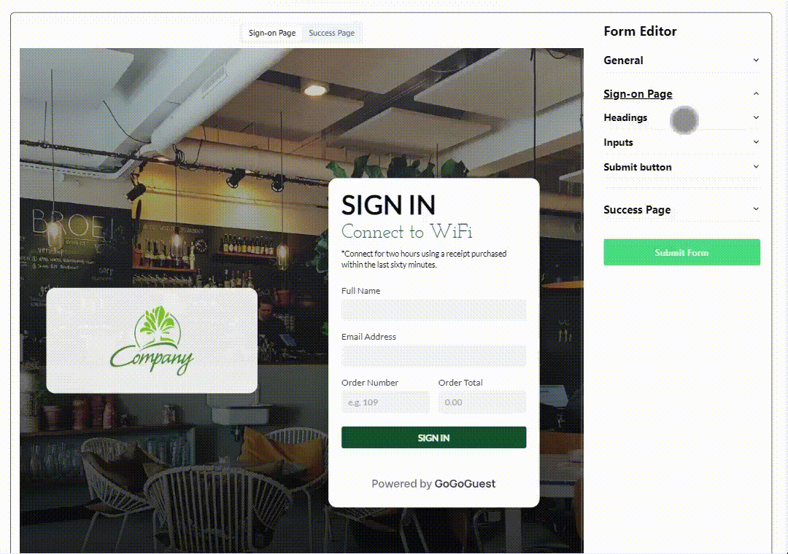
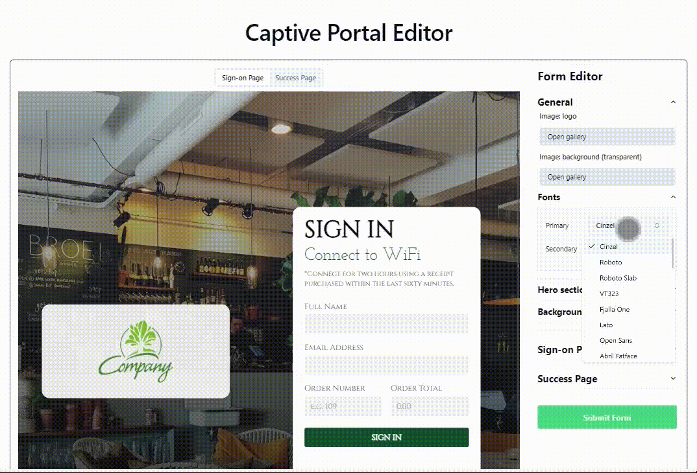
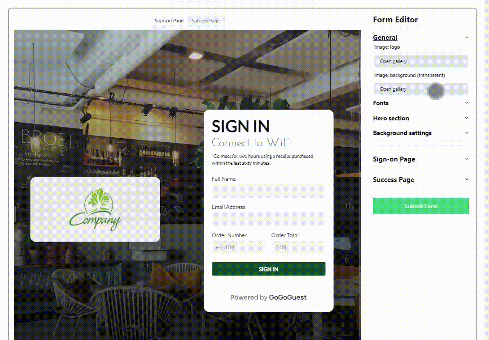

<h1 align="center">Landing creator</h1>

  

<h2 align="center"><a  href="https://landing-creator-2cxosu15i-owlsspell.vercel.app/captiveportal">Live Demo</a></h2>

## Description

It is a form editor that dynamically updates the appearance of the site.
The project is based on the Next.js 13 template and styled with Tailwind CSS.

### Fields update

Just try something to change

### Font update

You can change fonts on the entire site in an instant

### Images update

You can upload an image, preview it, crop and save it. Or just choose from a previously saved gallery

### About the project

The application implements the functions of dynamically updating data with saving it in the Zustang state. Tailwind values are used to update styles. The data is stored in MongoDB.

Pictures are saved in a local directory, but there is also the option to save them in the cloud. Before sending pictures to the server, the user can preview and crop them in advance. Images are automatically reduced before being saved.

Authorization is released using the clerk. Users from the same organization provided by the clerk can edit the same template.

### Stack of technologies:

- Typescript
- Next.js 13
- Zustand
- Tailwind
- Shadcn ui
- Clerk
- Mongodb
- DigitalOcean

## How to run

npm install

npm run dev
